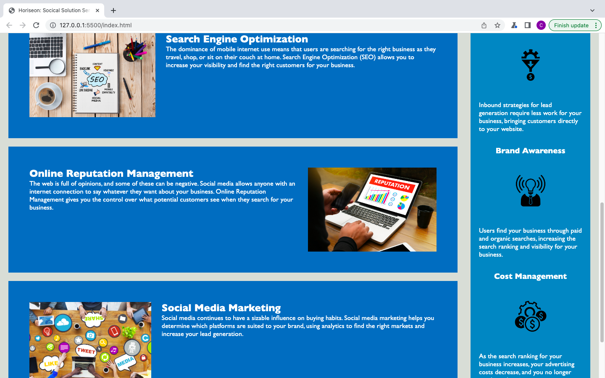

# Event-Horiseon
Horiseon Social Solutions Services website

## Table of Content

## Description

Horiseon needed a strong website to convey its commitment to helping buisinesses grow and achive their highest potential.  This website provides information about Horiseon as well as ways to communicate with and aquire their services.  Horiseon wanted a clean and consise site to show their main mission; helping the customer reach their goals through tools that will connect them to the entire internet through marketing, online reputation and search engine optimization.  

## Usage

<Provide instructions and examples for use. Include screenshots as needed.>
After loading the URL move your cursor over any of the products that are offered by Horiseon in the banner area.  Otherwise scroll down to read descriptions of Horiseon's goals and mission.

## Acknowledgments

Referenced following websites:
- https://stackoverflow.com
- https://www.w3schools.com
- Special thanks to Xpert, the AI Learning Assistant, for providing valuable assistance and guidence

## License

---MIT License

Copyright (c) [2023] [Christopher Robert Naro]

Permission is hereby granted, free of charge, to any person obtaining a copy
of this software and associated documentation files (the "Software"), to deal
in the Software without restriction, including without limitation the rights
to use, copy, modify, merge, publish, distribute, sublicense, and/or sell
copies of the Software, and to permit persons to whom the Software is
furnished to do so, subject to the following conditions:

The above copyright notice and this permission notice shall be included in all
copies or substantial portions of the Software.

THE SOFTWARE IS PROVIDED "AS IS", WITHOUT WARRANTY OF ANY KIND, EXPRESS OR
IMPLIED, INCLUDING BUT NOT LIMITED TO THE WARRANTIES OF MERCHANTABILITY,
FITNESS FOR A PARTICULAR PURPOSE AND NONINFRINGEMENT. IN NO EVENT SHALL THE
AUTHORS OR COPYRIGHT HOLDERS BE LIABLE FOR ANY CLAIM, DAMAGES OR OTHER
LIABILITY, WHETHER IN AN ACTION OF CONTRACT, TORT OR OTHERWISE, ARISING FROM,
OUT OF OR IN CONNECTION WITH THE SOFTWARE OR THE USE OR OTHER DEALINGS IN THE
SOFTWARE.

🏆 The previous sections are the bare minimum, and your project will ultimately determine the content of this document. You might also want to consider adding the following sections.

## Features

CSS design

# Horiseon Webpage
- https://crnaro.github.io/Event-Horiseon/

